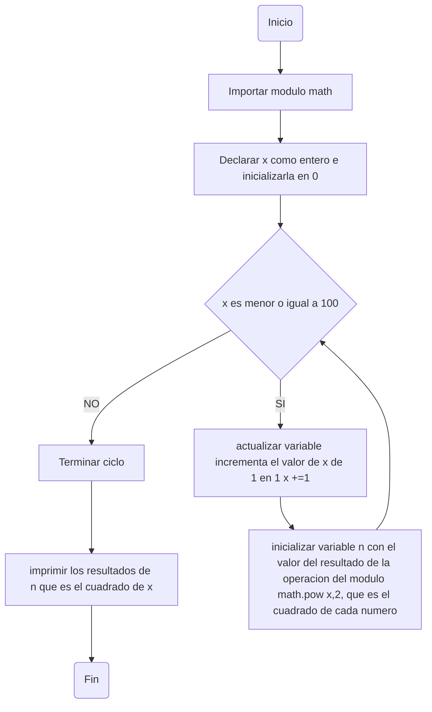
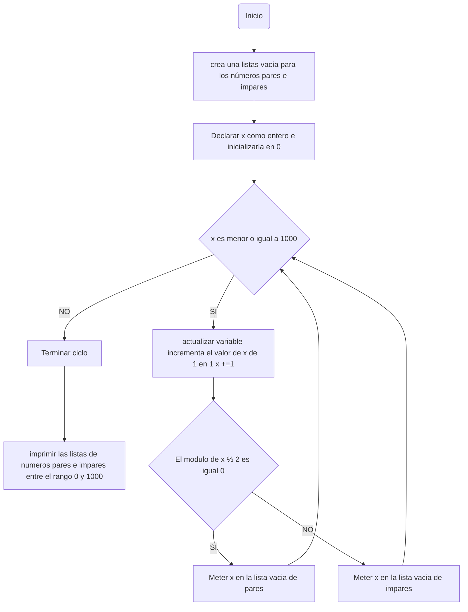

# :star: BUCLES-1 :star:
REALIZANDO NUESTRO RETO #7

## 1.EJERCICIOS DE CLASE
### :round_pushpin: EJERCICIO #1 
+ Diseñe un algoritmo que involucre un ciclo y que nunca ingrese al ciclo.

#### :space_invader: CODIGO DEL PROGRAMA

```ruby
x:int = 25 #<inicia>
print('El valor inicial de x es '+ str(x))
while(x <= 24): #<cond>
  print('El valor de x durante el ciclo') #<bloque>
  x = x + 1 #<actualiza> 
print('El valor final de x es '+ str(x))
```

:checkered_flag: **EL PROGRAMA EJECUTADO SE VE ASI**

<div align='center'>
<figure> </br>
<figcaption><b>Codigo donde <i>x</i> no ingresa al ciclo</b></figcaption></figure>
</div>


### :round_pushpin: EJERCICIO #2 
+ Diseñe un algoritmo que involucre un ciclo y que se ejecute indefinidamente.

#### :space_invader: CODIGO DEL PROGRAMA
```ruby
a = 1 # inicializa a en 1
b = 10 # inicializa b en 10
print('El valor inicial de a es '+ str(a) +'y de b es '+ str(a)) # valores iniciales de a y b 
while a < b: # mientras a sea menor a b
  print(a, b, sep = ", ") # imprime los valores de a y b usando el parametro separador 
  a += 1 # a = a + 1; i se incrementa de 1 en 1
  b += 10 # b = b + 10; se incrementa de 10 en 10
print("EL FIIIN.") # se ejecuta al terminar el ciclo
print(a, b, sep = ", ") # valores finales de a y b
```

:checkered_flag: **EL PROGRAMA EJECUTADO SE VE ASI**

<div align='center'>
<figure> </br>
<figcaption><b>Codigo donde <i>a y b</i> ingresan al ciclo y se ejecutan indefinamente</b></figcaption></figure>
</div>

### :round_pushpin: EJERCICIO #3 
+ Diseñe un algoritmo que pida un valor entero, y que siga leyendo valores enteros mientras que alguno de esos valores no represente el código ASCII de una letra mayúscula en el abc del inglés.

<div align='center'>
<figure> </br>
<figcaption><b>Tabla de caracteres con equivalente en ASCII.</b></figcaption></figure>
</div>

#### :space_invader: CODIGO DEL PROGRAMA
```ruby
num : int = 0 # inicializa num en 0
while num < 65 or num > 90: # mientras sea menor de 65 o mayor de 90
  num = int(input("Ingrese un entero: ")) # usuario mete el numero entero
  print("El entero " + str(num) + " corresponde al caracter " + chr(num)) # Caracter que corresponde al numero
```

:checkered_flag: **EL PROGRAMA EJECUTADO SE VE ASI**

<div align='center'>
<figure> </br>
<figcaption><b>Codigo donde <i> num </i> ingresan al ciclo y se ejecuta hasta que corresponda a una letra en mayuscula en el código ASCII </b></figcaption></figure>
</div>


## PUNTOS DEL RETO
### :round_pushpin: PUNTO #1 
+ Imprimir un listado con los números del 1 al 100 cada uno con su respectivo cuadrado.

#### :space_invader: CODIGO DEL PROGRAMA
```ruby
import math
x : int = 0 # inicializa la variable x en 0
while (x <= 100) : # mientras x sea menor o igual a 100
    x +=1 # incrementa el valor de x en 1
    if x == 101:# si x es igual a 101, se salta al siguiente ciclo
        continue
    n:int = math.pow (x,2) # calcula el cuadrado de x y lo almacena en la variable n
    print("el cuadrado de " + str(x) + " es " + str(n) ) # imprime el resultado del cuadrado de x

```
:checkered_flag: **EL PROGRAMA EJECUTADO SE VE ASI**

<div align='center'>
<figure> </br>
<figcaption><b>Codigo donde <i> X </i> ingresan al ciclo y se ejecuta hasta hacer un listado de 1 al 100 con sus respectivos cuadrados</b></figcaption></figure>
</div>

#### DIAGRAMA DE FLUJO


### :round_pushpin: PUNTO #2 
+ Imprimir un listado con los números impares desde 1 hasta 999 y seguidamente otro listado con los números pares desde 2 hasta 1000.


#### :space_invader: CODIGO DEL PROGRAMA
```ruby
pares = [] # crea una lista vacía para los números pares
impares = [] # crea una lista vacía para los números impares
x : int = 0 # inicializa la variable x en 0
while (x <= 1000) : # mientras x sea menor o igual a 1000
    x +=1 # incrementa el valor de x en 1
    if x == 1001:# si x es igual a 1001, se salta al siguiente ciclo
        continue
    if x % 2 == 0 :# si el residuo de la division es igual a 0 es par
         pares.append(x)
    else:
        x % 2 != 0 # si el residuo de la division no es igual a 0 es impar
        impares.append(x)
print("Numeros Pares " + str(pares)) # imprime la lista de pares
print("Numeros Impares" + str(impares)) # imprime la lista de impares
```
:checkered_flag: **EL PROGRAMA EJECUTADO SE VE ASI**

<div align='center'>
<figure> </br>
<figcaption><b>Codigo donde <i> x </i> ingresan al ciclo y se ejecuta hasta hacer un listado de numeros pares hasta 1000 y otro de numeros impares hasta 999</b></figcaption></figure>
</div>

#### DIAGRAMA DE FLUJO

    
### :round_pushpin: PUNTO #3  
+ Imprimir los números pares en forma descendente hasta 2 que son menores o iguales a un número natural n ≥ 2 dado


#### :space_invader: CODIGO DEL PROGRAMA
```ruby
pares = [] # Crea una lista vacía para los números pares
n = int(input("Ingrese un número natural mayor o igual a 2: ")) # Declara e inicializa variable con valor dado por el usuario
# Imprime los números pares en forma descendente hasta 2
while n >= 2: # Mientras que n sea mayor o igual a 2
    pares.append(n)
    n -= 2 # Disminuye de dos en dos para que pueda imprimirse de manera descendente
    if n % 2 != 0: # Descarta los numeros impares
        continue
print("Numeros pares de forma descendente " + str(pares)) # Imprime la lista pares en forma descendente hasta 2
```

:checkered_flag: **EL PROGRAMA EJECUTADO SE VE ASI**

<div align='center'>
<figure> </br>
<figcaption><b>Codigo donde <i> n </i> ingresan al ciclo y se ejecuta y hace un listado de numeros pares en forma descendente hasta el 2 999</b></figcaption></figure>
</div>

#### DIAGRAMA DE FLUJO
```mermaid
graph TD;

```

### :round_pushpin: PUNTO #4 
+ En 2022 el país A tendrá una población de 25 millones de habitantes y el país B de 18:9 millones. Las tasas de crecimiento anual de la población serán de 2% y 3% respectivamente. Desarrollar un algoritmo para informar en que año la población del país B superará a la de A.


#### :space_invader: CODIGO DEL PROGRAMA
```ruby
# inicializamos variables
a = 25 # Población inicial del país A en millones
b = 18.9 # Población inicial del país B en millones
crecimiento_a = 0.02 # Tasa de crecimiento anual del país A
crecimiento_b = 0.03 # Tasa de crecimiento anual del país B
year = 2022 # Año inicial

while b <= a: # Mientras la población del país B sea menor o igual que la del pais A
    a += a * crecimiento_a # Se suma la cantidad de personas segun la tasa de crecimiento anual
    b += b * crecimiento_b # Se suma la cantidad de personas segun la tasa de crecimiento anual
    year += 1 # Aumenta de 1 en 1 para evaluar el crecimiento anual
    
print(f"La población del país B superará a la del país A en el año {year} con una poblacion " + str( b ) +" millones frente a una poblacion de " + str( a ) + " millones de el pais A") # Imprime el año en que la población de B supera a la de A
```

:checkered_flag: **EL PROGRAMA EJECUTADO SE VE ASI**

<div align='center'>
<figure> </br>
<figcaption><b>Codigo donde <i> a y b </i> ingresan al ciclo y se ejecuta hasta que la poblacion del pais B (valor de b) supere a la poblacion del pais A (valor de a)</b></figcaption></figure>
</div>

### :round_pushpin: PUNTO #5  
+ Imprimir el factorial de un número natural n dado.


#### :space_invader: CODIGO DEL PROGRAMA
```ruby
n = int(input("Ingrese un número natural: ")) # Declarar e inicializar con el valor dado por el usuario
factorial = 1 # Inicializar la variable factorial en 1
i: int
i = 1 # Inicializar la variable i en 1
while i <= n: # Mientras que i sea menor o igual a n
    factorial *= i # Se multiplica factorial por i cambiando sus valores con cada iteracion
    i += 1 # Aumenta de 1 en 1 para poder ir multiplicando por el siguiente numero
print(f"El factorial de {n} es {factorial}") # Imprimir el factorial de n
```

:checkered_flag: **EL PROGRAMA EJECUTADO SE VE ASI**

<div align='center'>
<figure> </br>
<figcaption><b>Codigo donde <i> n </i> ingresa al ciclo y se ejecuta para hallar su factorial</b></figcaption></figure>
</div>

### :round_pushpin: PUNTO #6 
+ Implementar un algoritmo que permita adivinar un número dado de 1 a 100, preguntando en cada caso si el número es mayor, menor o igual.


#### :space_invader: CODIGO DEL PROGRAMA
```ruby
while True: # Utilizamos la sentencia while true para hacer un bucle infinito hasta encontrar un break
    inicio = input("Piensa un numero entre el rango del 1 al 100 escibe 'ya' si estas listo ")
    if inicio == "ya":
        print("te hare una serie de preguntas responde 's' para si y n para 'no'") # Detalles para que parezca un juego
    else:
        print("Respuesta inválida, intente de nuevo.")
        continue

    # Definir las constantes para el rango de búsqueda
    RANGO_MINIMO = 1
    RANGO_MAXIMO = 100

    # Inicializar las variables para la búsqueda
    minimo = RANGO_MINIMO
    maximo = RANGO_MAXIMO
    intentos = 0

    while minimo <= maximo: # mientras el minimo sea menor o igual que el maximo
        intentos += 1  # Incrementar el contador de intento
    
        medio = (minimo + maximo) // 2 # Adivinar el número medio del rango actual
        respuesta = input(f"¿Es {medio} el número? (s/n) ")

        # Actualizar el rango de búsqueda según la respuesta
        if respuesta == "s": 
            print(f"¡Adiviné el número en {intentos} intentos!")
            break
        elif respuesta == "n":
            respuesta = input(f"¿Es el número mayor o menor que {medio}? (mayor/menor) ")
            if respuesta == "mayor":
                minimo = medio + 1
            elif respuesta == "menor":
                maximo = medio - 1
            else:
                print("Respuesta inválida, intente de nuevo.")
        else:
            print("Respuesta inválida, intente de nuevo.")

    # Preguntar al usuario si desea jugar nuevamente
    jugar_nuevamente = input("¿Desea jugar nuevamente? (s/n) ")
    if jugar_nuevamente != "s":
        break
```

:checkered_flag: **EL PROGRAMA EJECUTADO SE VE ASI**

<div align='center'>
<figure> </br>
<figcaption><b>Codigo donde <i> RANGO ENTRE 1 Y 100 </i> ingresa al ciclo y se ejecuta para adivinar por medio de la reduccion del rango y por medio de ensayo y error </b></figcaption></figure>
</div>

### :round_pushpin: PUNTO #7 
+ Implementar un programa que ingrese un número de 2 a 50 y muestre sus divisores.

#### SOLUCION 1 SIN RANGO
#### :space_invader: CODIGO DEL PROGRAMA
```ruby
divisores = [] # Creamos una lista vacia para los divisores
x = int(input("Ingrese el número del cual quiera saber sus divisores: ")) # Inicializamos variable con valor (numero entero) dado por el usuario 
i = 1 # inicializamos i en 1
while i <= x: # mientras i sea menor o igual a x
    if x % i == 0: 
        divisores.append(i)
    i += 1 # Actualizamos variable para continuar evaluando el siguiente numero 
print("Los divisores de " + str(x) + " son " + str(divisores)) # imprimimos resulado de los divisoes de x
```

:checkered_flag: **EL PROGRAMA EJECUTADO SE VE ASI**

<div align='center'>
<figure> </br>
<figcaption><b>Codigo donde <i> x </i> ingresa al ciclo y se ejecuta hasta encontrar todos sus divisores por medio de un modulo </b></figcaption></figure>
</div>

#### SOLUCION 2 CON RANGO DE 2 A 50
#### :space_invader: CODIGO DEL PROGRAMA
```ruby
numero = int(input("Ingrese un número entre 2 y 50: ")) # Pedir al usuario que le de valor a la variable numero entre 2 y 50
while numero < 2 or numero > 50: # Mientras que numero sea menor a 2 y mayor a 50
    print("Número inválido, intente de nuevo.")
    numero = int(input("Ingrese un número entre 2 y 50: "))

divisores = [] # Inicializar una lista vacía para los divisores
i = 1 # Inicializar un i en 1

while i <= numero: # mientras que i sea menor o igual a numero
    if numero % i == 0:
        divisores.append(i)
    i += 1 # actualizar variable para el siguiente numero

print(f"Los divisores de {numero} son: {divisores}") # imprimir los divisores de numero
```

:checkered_flag: **EL PROGRAMA EJECUTADO SE VE ASI**

<div align='center'>
<figure> </br>
<figcaption><b>Codigo donde <i> numero </i> ingresa a un primer ciclo para ver si entra en el rango y si es asi entra a l segundo para encontrar todos sus divisores por medio de un modulo </b></figcaption></figure>
</div>

### :round_pushpin: PUNTO #8  
+ Implementar el algoritmo que muestre los números primos del 1 al 100. nota: use funciones

#### :space_invader: CODIGO DEL PROGRAMA
```ruby
import math # Importar el módulo math

def es_primo(numero):
    if numero < 2: # Si el número es menor que 2, no es primo
        return False
    i = 2 # Inicializa i en 2 ( i es el divisor )
    while i <= int(math.sqrt(numero)): # Mientras el divisor sea menor o igual que la raíz cuadrada del número
        if numero % i == 0: # Si el número es divisible por el divisor actual
            return False # El número no es primo
        i += 1 # Incremnetar de 1 en 1 el divisor
    return True # Si ningún divisor lo divide, el número es primo

if __name__ == "__main__":
    numero = 1  # Inicializa a numero ( primer número a comprobar ) 
    while numero <= 100:  # mientras el número sea menor o igual a 100
        if es_primo(numero): # si el número es primo ( se llama a la funcion )
            print(numero, end=", ") # Imprime el número en la misma línea, separado por una coma
        numero += 1 # incrementa el número a comprobar en 1 para pasar al siguiente
```

:checkered_flag: **EL PROGRAMA EJECUTADO SE VE ASI**

<div align='center'>
<figure> </br>
<figcaption><b>Codigo donde <i> numero </i> ingresa a un ciclo donde se llama a la funcion funcion <i> es_primo </i>  previamente definida que toma como argumento a numero</b></figcaption></figure>
</div>

## :sparkles: Esto es todo hoy amigos :blush:, espero poder haberlos ayudado he inspirado para encontar nuevas solociones para nuevos retos :sparkles: 
